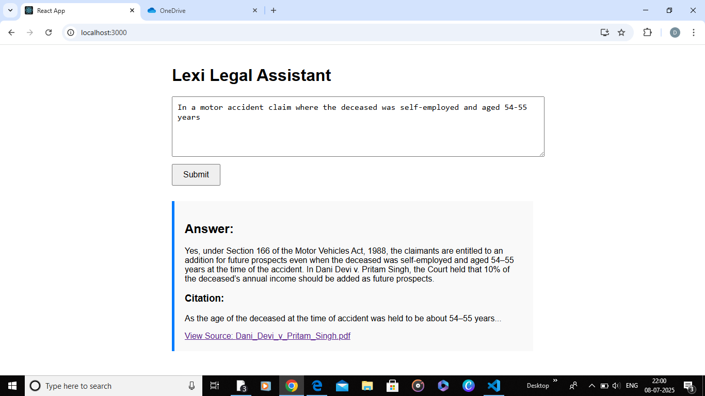

# Lexi Frontend Intern Test – Legal Assistant Interface

This is a simple React frontend interface simulating a legal assistant like **Lexi**, where users can:

- Ask a legal question
- See an AI-generated answer
- View the legal citation
- Click citation to open original PDF

---

## 📌 Tech Stack

- React.js
- Plain CSS (`App.css`)

---

## 🚀 How to Run the Project

1. Clone this repository  
   `git clone https://github.com/your-username/lexisg-frontend-intern-test.git`

2. Install dependencies  
   `npm install`

3. Start the app  
   `npm start`

The app will open at `http://localhost:3000`

---

## ❓ Simulated Legal Query

> “In a motor accident claim where the deceased was self-employed and aged 54–55 years at the time of death, is the claimant entitled to an addition towards future prospects in computing compensation under Section 166 of the Motor Vehicles Act, 1988?”

---

## ✅ Output Screenshot

Below is a screenshot of the running frontend assignment:

---

## 📎 Citation Handling

- The citation is displayed below the answer
- Clicking on the source opens the actual PDF link in a new tab
- PDF link used:  
  [Dani_Devi_v_Pritam_Singh.pdf](https://lexisingapore-my.sharepoint.com/:b:/g/personal/harshit_lexi_sg/EdOegeiR_gdBvQxdyW4xE6oBCDgj5E4Bo5wjvhPHpqgIuQ?e=TEu4vz)

---

